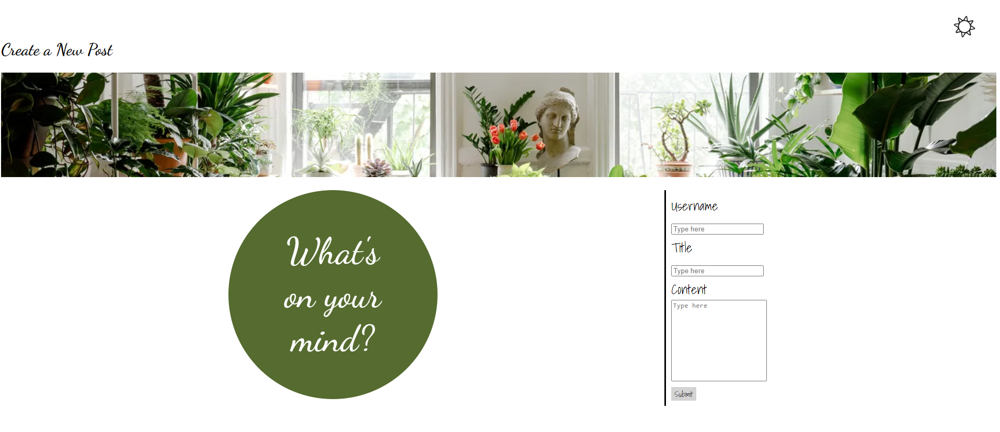
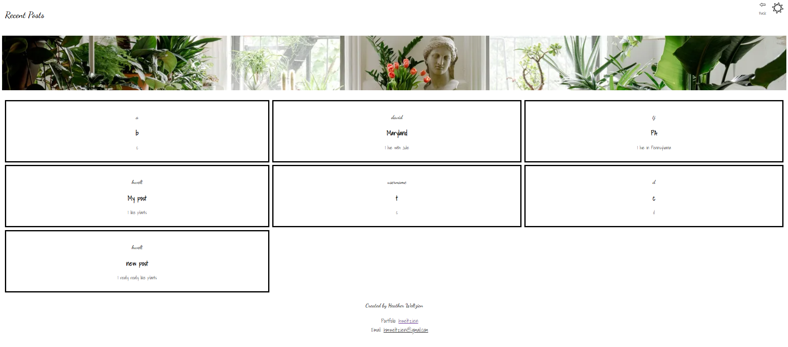

# Personal Blog

## Description
After utilizing web-based resources and instructional support, I learned how to dynamically create HTML elements and to display stored data on the DOM. I also learned about the properties of an "event listener." I used an event listener to create a light/dark mode toggle, a "submit" button to direct the user to the next page, and a "back" button to direct the user to a previous page. Moreover, this project further developed my JavaScript knowledge and skills.

## Table of Contents 

- [Installation](#installation)
- [Usage](#usage)
- [How-To-Guide](#how-to-guide)
- [Credits](#credits)
- [License](#license)

## Installation

To clone the assignment, click the green button labeled, "code." Copy the URL for the repository, using HTTPS, SSH, or GitHub CLI. Open Git Bash. Change the working directory to the desired location for the cloned directory. Type "git clone" and paste the copied URL. Press "enter" to create your local clone.

## Usage

Beginning on "index.html," the user will see the heading, "Create a New Post" and a form to collect user input. After completing the form and upon clicking the "submit" button, the user is directed to "blog.html." The user will see the heading, "Recent Posts" and is presented with user input in a grid template. In the footer, there is a link to the author's portfolio. The user can click the "back" button to complete the form again. Both pages have a light/dark mode toggle.   

## How-To-Guide
<ul>    
    <li>GIVEN a personal blog</li>
    <li>WHEN I load the app</li>
    <li>THEN I am presented with the landing page containing a form with labels and inputs for username, blog title, and blog content</li>
    <li>WHEN I submit the form</li>
    <li>THEN blog post data is stored to localStorage</li>
    <li>WHEN the form submits</li>
    <li>THEN I am redirected to the posts page</li>
    <li>WHEN I enter try to submit a form without a username, title, or content</li>
    <li>THEN I am presented with a message that prompts me to complete the form</li>
    <li>WHEN I view the posts page</li>
    <li>THEN I am presented with a header, with a light mode/dark mode toggle, and a "Back" button</li>
    <li>WHEN I click the light mode/dark mode toggle</li>
    <li>THEN the page content's styles update to reflect the selection</li>
    <li>WHEN I click the "Back" button</li>
    <li>THEN I am redirected back to the landing page where I can input more blog entries</li>
    <li>WHEN I view the main content</li>
    <li>THEN I am presented with a list of blog posts that are pulled from localStorage</li>
    <li>WHEN I view localStorage</li>
    <li>THEN I am presented with a JSON array of blog post objects, each including the post author's username, title of the post, and post's content</li>
    <li>WHEN I take a closer look at a single blog entry in the list</li>
    <li>THEN I can see the title, the content, and the author of the post</li>
    <li>WHEN I view the footer</li>
    <li>THEN I am presented with a link to the developer's portfolio</li>
</ul>

## Credits
<ul>
    <li>Tutoring session with Benicio Lopez</li>
    <li>Collaboration with Robert Saavendra Jr.</li>
    <li>Office hours with Erik Hirsch</li>
    <li>Office hours with Anthony Barragan</li>
    
</ul>

## License
 
Please refer to the LICENSE in the repo.

# [link to completed project](______________ '_blank')